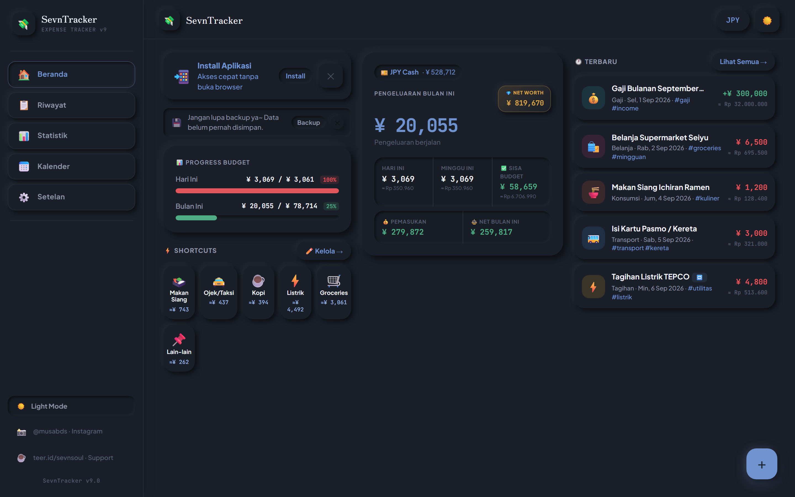
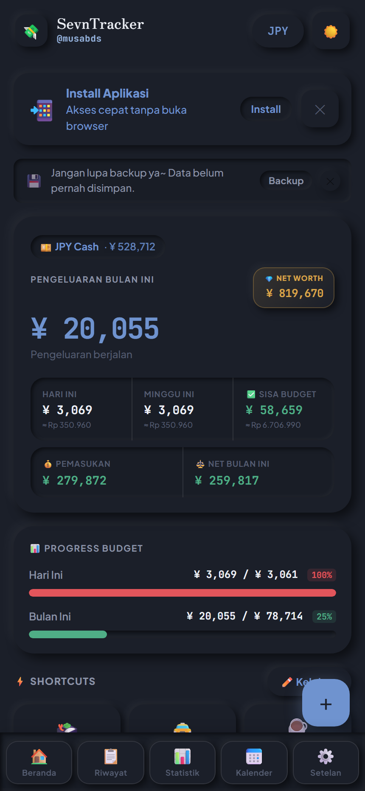
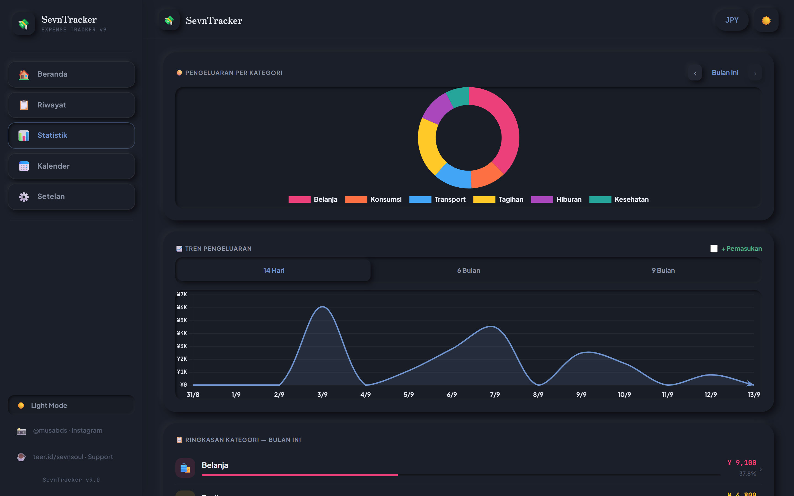
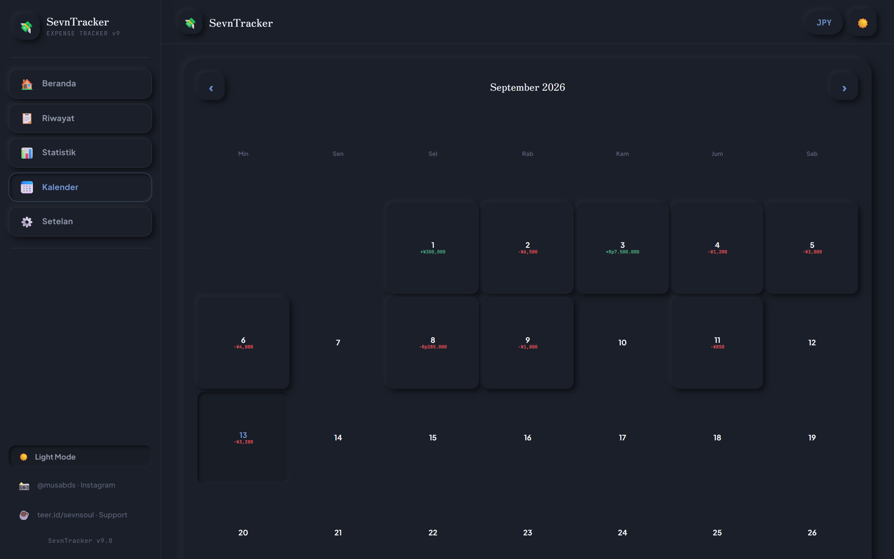
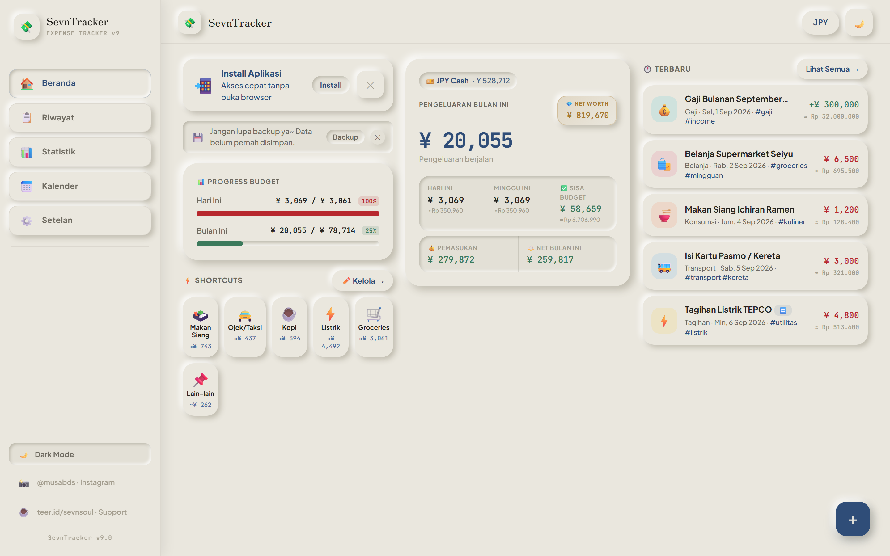
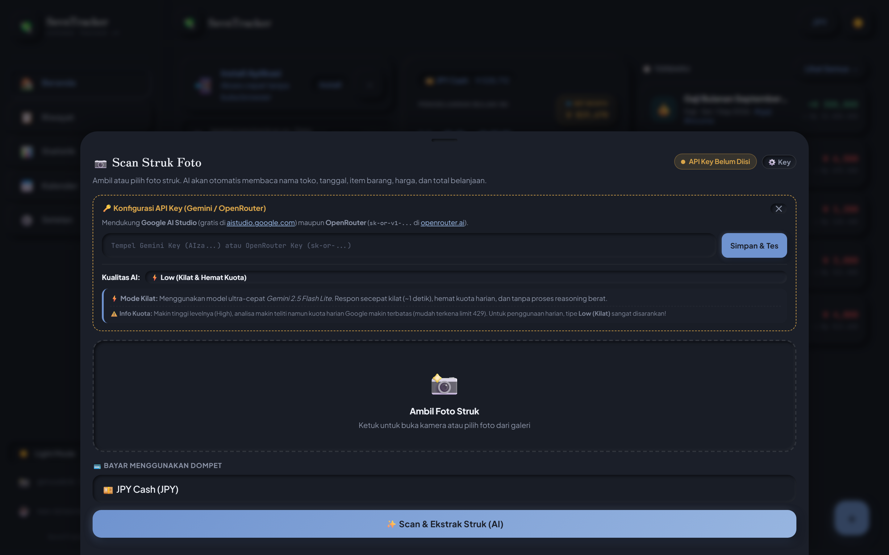
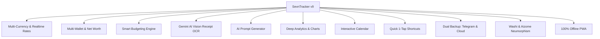

# 💸 SevnTracker v9 — Finansial Pribadi Tanpa Batas
### *Aplikasi Pencatat Keuangan Multi-Mata Uang, Multi-Kantong & Bertenaga AI dengan Filosofi Desain "Washi & Aizome" Neumorphism*

[](https://github.com/)
[](https://github.com/)
[](https://github.com/)
[](https://github.com/)
[](https://github.com/)

---

## 🌟 Ringkasan Eksekutif & Value Proposition

**SevnTracker v9** adalah solusi pencatatan dan manajemen keuangan pribadi (*personal finance tracker*) modern yang memadukan kecepatan eksekusi **Offline-First**, fleksibilitas transaksi **Multi-Mata Uang (IDR, JPY, USD)**, pembagian **Multi-Kantong (Multi-Wallet)**, serta kecerdasan buatan **Google Gemini Vision AI** untuk memindai struk belanja secara otomatis.

Dibalut dalam estetika antarmuka **"Washi & Aizome" Soft-Touch Neumorphism**, SevnTracker memberikan pengalaman visual yang tenang, taktual, dan bebas dari distraksi iklan maupun pelacakan data komersial (*zero tracking*). Baik Anda seorang pekerja diaspora di Jepang, ekspatriat, mahasiswa, freelancer lintas negara, maupun pengelola keuangan keluarga — SevnTracker dirancang untuk menjadi asisten finansial paling intuitif dan andal di perangkat Anda.

---

## 📸 Galeri Tampilan Aplikasi (Screenshots Preview)

| Tampilan Desktop (Dark Mode) | Tampilan Mobile (Dark Mode) |
| :---: | :---: |
|  |  |
| *Beranda Desktop dengan ringkasan saldo, progress budget, dan shortcuts.* | *Beranda Mobile dengan navigasi bawah dan tombol cepat.* |

| Visualisasi Statistik & Grafik | Kalender Finansial Interaktif |
| :---: | :---: |
|  |  |
| *Donut Chart kategori pengeluaran dan tren 14 hari/6 bulan.* | *Heatmap harian pengeluaran per tanggal dengan rincian instan.* |

| Tema "Washi Sand" Light Mode | AI Scan Struk Belanja (OCR) |
| :---: | :---: |
|  |  |
| *Estetika kertas Washi tradisional Jepang yang hangat di mata.* | *Pemindaian otomatis foto struk bertenaga Google Gemini Vision.* |

---

## 🎯 Siapa yang Membutuhkan SevnTracker?

1. **Diaspora & Pekerja Internasional (misal: Pekerja di Jepang / Luar Negeri)**
   - Mendukung pencatatan pengeluaran harian dalam **JPY (Yen)** atau **USD (Dollar)** sekaligus melihat nilai konversinya secara instan dalam **IDR (Rupiah)** berdasarkan kurs pasar terkini.
2. **Traveler & Digital Nomad**
   - Berpindah antar negara tanpa kebingungan menghitung selisih kurs. Pisahkan uang tunai, kartu kredit, dan dompet digital dalam kantong terpisah.
3. **Freelancer & Pekerja Lepas**
   - Pantau pemasukan proyek, hitung pengeluaran operasional, serta lacak keuntungan bersih (*Net Cashflow*) setiap bulannya.
4. **Pengelola Keuangan Mandiri & Mahasiswa**
   - Tetapkan batas anggaran harian (*daily budget*) dan bulanan (*monthly budget*) agar tidak terjadi overspending sebelum tanggal gajian.
5. **Pencari Privasi Mutlak (Privacy Enthusiasts)**
   - Semua data tersimpan aman secara lokal di perangkat Anda. Tanpa akun perbankan tertaut, tanpa penjualan data analitik, dan tanpa iklan pop-up yang mengganggu.

---

## ⚡ 11 Pilar Fitur Utama SevnTracker v9



---

### 1. 💱 Multi-Currency & Kurs Real-Time Otomatis
- **Tiga Mata Uang Utama**: Kelola keuangan dalam **IDR (Rp)**, **JPY (¥)**, dan **USD ($)** secara simultan.
- **Auto-Sync Nilai Tukar**: Mengambil kurs pasar valas terbaru secara otomatis melalui API publik terpercaya (*frankfurter.app*).
- **Manual Rate Override**: Kemudahan menyesuaikan kurs tukar secara manual sesuai rate riil bank atau money changer langganan Anda.
- **Dual Display Realtime**: Setiap nominal pengeluaran/pemasukan menampilkan nilai asli dan estimasi konversi mata uang sekundernya secara langsung.

---

### 2. 💳 Multi-Wallet & Kalkulasi Kekayaan Bersih (Net Worth)
- **Kustomisasi Kantong Tak Terbatas**: Buat kantong tunai (*Cash*), rekening bank (*BCA, Mandiri, JP Post, SMBC*), e-wallet (*GoPay, OVO*), maupun tabungan valas (*Wise*).
- **Identitas Personal**: Sesuaikan emoji ikon, mata uang spesifik, serta warna aksen untuk setiap kantong.
- **Transfer Antar Kantong**: Pindahkan saldo antar rekening dengan catatan kurs konversi otomatis.
- **Diamond Net Worth Metric**: Kartu ringkasan eksklusif yang mengakumulasikan total seluruh aset dari semua kantong ke dalam satu nilai kekayaan bersih terpadu.

---

### 3. 📊 Smart Budgeting Engine & Indikator Waspada
- **Batas Anggaran Harian (*Daily Budget*)**: Menjaga pengeluaran harian tetap terkendali dengan indikator warna:
  - 🟢 **Matcha Green**: Pengeluaran aman di bawah batas limit.
  - 🟡 **Kinako Gold**: Pengeluaran mendekati 80%-99% dari batas limit.
  - 🔴 **Hanko Red**: Alarm pengeluaran telah melebihi batas (*Over Budget*).
- **Batas Anggaran Bulanan (*Monthly Budget*)**: Memonitor laju belanja bulanan dengan persentase real-time dan sisa anggaran (*Remaining Budget*) yang tersisa.

---

### 4. 📸 Pemindai Struk Belanja Bertenaga AI (Gemini Vision OCR)
- **Ekstraksi Otomatis**: Cukup arahkan kamera ponsel ke struk kasir toko, minimarket (7-Eleven, Lawson, FamilyMart, Indomaret), atau restoran.
- **Pemrosesan Cerdas**: Model AI tingkat lanjut **Google Gemini 2.5 Flash Lite** membaca:
  - Nama toko / merchant
  - Tanggal transaksi
  - Rincian item dan kuantitas
  - Total nominal tagihan
  - Kategori belanja yang paling sesuai
- **Pilihan Kualitas AI**:
  - ⚡ **Mode Kilat (Flash Lite)**: Respon ultra-cepat (~1 detik), hemat token/kuota.
  - 🧠 **Mode Presisi (Pro/Flash)**: Analisis mendalam untuk tulisan struk yang pudar atau berkerut.
- **Fleksibilitas API**: Mendukung integrasi API Key gratis dari Google AI Studio maupun OpenRouter.

---

### 5. 🤖 AI Import & Prompt Generator
- **Voice-to-Text & Text Assistant**: Anda malas mengetik formulir satu per satu? Cukup tulis atau rekam suara, contoh: *"Tadi makan siang ramen 1200 yen di Shibuya dan beli kopi 450 yen pakai cash"*.
- **Prompt Generator 1-Klik**: Generator otomatis menyusun prompt sistematis untuk Gemini atau ChatGPT.
- **Direct JSON Ingestion**: Tempel respon JSON dari AI, dan sistem akan mengonversinya menjadi transaksi resmi dalam hitungan detik.

---

### 6. ⚡ Quick Shortcuts (Pencatatan Cepat Sekali Sentuh)
- **Preset Pengeluaran Rutin**: Sediakan tombol cepat di beranda untuk pengeluaran berulang (Makan Siang, Ongkos Kereta/Ojek, Kopi, Bayar Listrik, Belanja Mingguan).
- **One-Tap Execution**: Sentuh shortcut, nominal dan kategori langsung terisi otomatis tanpa perlu mengetik ulang form panjang.
- **Manajemen Kustom**: Bebas menambah, mengubah nama, ikon, nominal default, dan kategori shortcut kapan saja.

---

### 7. 📈 Analisis Visual Mendalam & Grafik Interaktif
- **Doughnut Chart Proporsi Belanja**: Ketahui ke mana uang Anda paling banyak dialokasikan (Konsumsi, Transport, Belanja, Tagihan, Hiburan, Kesehatan, Lainnya).
- **Line & Bar Trend Chart**: Visualisasi tren pengeluaran harian dan mingguan dalam rentang **14 Hari**, **6 Bulan**, hingga **9 Bulan**.
- **Tabel Perbandingan Bulanan (Cashflow Health)**: Komparasi langsung performa pemasukan (*Money In*), pengeluaran (*Money Out*), dan selisih laba/rugi bersih (*Net Flow*) per bulan.

---

### 8. 📅 Kalender Finansial Interaktif
- **Peta Pengeluaran Bulanan**: Tampilan kalender intuitif dengan nominal total pengeluaran tercetak langsung di setiap tanggal transaksi.
- **Highlight Tanggal Aktif**: Tanggal hari ini diberi pendaran visual khusus agar Anda selalu sadar posisi anggaran berjalan.
- **Pemeriksaan Detail Instan**: Ketuk tanggal manapun pada kalender untuk membuka modal lembar rincian semua transaksi yang terjadi pada hari itu.

---

### 9. 🛡️ Dual Backup System: Privasi Lokal + Keamanan Cloud
- **🤖 Backup Otomatis Telegram Bot**:
  - Sambungkan bot Telegram pribadi Anda dalam 2 langkah mudah.
  - Kirim backup data terenkripsi format JSON langsung ke chatbox Telegram pribadi Anda dengan satu sentuhan. Data tersimpan aman di cloud pribadi tanpa pihak ketiga.
- **☁️ Supabase Cloud Sync**:
  - Fitur registrasi dan login akun terenkripsi untuk menyinkronkan data keuangan Anda di berbagai perangkat (laptop kantor, ponsel Android, iPad) secara otomatis.
- **📦 Smart Import & Deduplication**:
  - Ekspor file backup `.json` kapan saja.
  - Saat memulihkan data, tersedia opsi **"Import & Ganti"** atau **"Import & Tambah"** yang dilengkapi fitur deteksi pintar untuk mencegah transaksi duplikat.

---

### 10. 🎨 Desain "Washi & Aizome" Neumorphism
- **Filosofi Jepang**: Terinspirasi dari ketenangan kertas tradisional *Washi* dan pewarna nila alami *Aizome*.
- **Single-Surface Sculpting**: Elemen kartu, tombol, dan kolom input dipahat dari material dasar kanvas dengan bayangan ganda halus (*dual shadow highlights*), bukan garis batas kaku (*no harsh borders*).
- **Dark & Light Mode Paripurna**:
  - 🌙 **Dark Charcoal Blue (`#1b1f29`)**: Memberikan kedalaman visual yang elegan dan hemat baterai pada layar OLED.
  - ☀️ **Washi Sand Light Mode (`#eae7de`)**: Nuansa pasir krem hangat yang menenangkan dan tidak silau di mata.
- **Adaptif Responsif**:
  - Layar Ponsel: Dilengkapi **Bottom Navigation Bar** dan **Floating Speed Dial FAB**.
  - Layar Desktop/Tablet: Mengubah tata letak otomatis menjadi **Desktop Sidebar Navigation** dengan dashboard multi-kolom yang luas.

---

### 11. 📱 100% Offline-First Progressive Web App (PWA)
- **Install Tanpa App Store**: Pasang langsung ke layar utama (*Home Screen*) ponsel Anda melalui browser Chrome, Safari, atau Edge.
- **Bekerja Tanpa Internet**: Akses dan catat pengeluaran di mana saja — di dalam kereta bawah tanah (subway), di atas pesawat, maupun di daerah terpencil tanpa sinyal internet.
- **Ringan & Cepat**: Berjalan dengan arsitektur web modern tanpa bloatware, tidak memberatkan memori perangkat.

---

## 📊 Matriks Perbandingan Fitur

| Fitur / Kemampuan | SevnTracker v9 | Aplikasi Finansial Bank Konvensional | Aplikasi Finansial Gratisan di Play Store |
| :--- | :---: | :---: | :---: |
| **Iklan / Ads** | ❌ **100% Bebas Iklan** | ❌ Iklan produk pinjaman/asuransi | ⚠️ Banner & video iklan berulang |
| **Privasi Data** | 🔒 **Zero Tracking (Milik Anda)** | ⚠️ Terhubung data perbankan | ⚠️ Data dijual untuk profiling iklan |
| **Fungsi Offline** | ✅ **100% Berfungsi Penuh** | ❌ Wajib koneksi stabil | ⚠️ Fitur terbatas saat offline |
| **Multi-Mata Uang (JPY/IDR/USD)** | ✅ **Realtime API + Manual** | ❌ Hanya satu mata uang lokal | 🔒 Harus langganan Premium bulanan |
| **Multi-Kantong (Multi-Wallet)** | ✅ **Bebas Tanpa Batas** | ❌ Terikat rekening asli | 🔒 Terbatas 2-3 dompet saja |
| **AI Scan Struk Belanja (OCR)** | ✅ **Gemini AI Terintegrasi** | ❌ Tidak tersedia | 🔒 Dibatasi kuota / bayar langganan |
| **Backup Telegram Bot** | ✅ **Bawaan (Gratis)** | ❌ Tidak tersedia | ❌ Tidak tersedia |
| **Cloud Sync Antar Perangkat** | ✅ **Supabase Sync Aman** | ⚠️ Hanya 1 device terdaftar | 🔒 Bayar cloud storage |
| **Biaya Langganan** | 🆓 **Gratis & Open Source** | Gratis (dengan syarat) | Berlangganan Rp 50rb–150rb/bulan |

---

## 🗂️ Direktori Tangkapan Layar Lengkap

Seluruh tangkapan layar antarmuka resolusi tinggi telah disimpan dalam folder `screenshots/` dan `screenshoot/`:

| No | Nama File | Deskripsi Layar & Fitur |
| :---: | :--- | :--- |
| 1 | [`01_dashboard_desktop_dark.png`](screenshots/01_dashboard_desktop_dark.png) | Beranda Desktop (Dark Mode) — Net Worth, Budgets, Shortcuts, Transaksi |
| 2 | [`02_dashboard_mobile_dark.png`](screenshots/02_dashboard_mobile_dark.png) | Beranda Mobile (iPhone Viewport) — Bottom Nav, Speed Dial FAB, Quick View |
| 3 | [`03_history_desktop_dark.png`](screenshots/03_history_desktop_dark.png) | Riwayat Transaksi Desktop — Realtime Search, Kategori Chips, Filter Dompet & Tanggal |
| 4 | [`04_history_mobile_dark.png`](screenshots/04_history_mobile_dark.png) | Riwayat Transaksi Mobile — Tampilan ringkas untuk kemudahan interaksi satu tangan |
| 5 | [`05_stats_desktop_dark.png`](screenshots/05_stats_desktop_dark.png) | Statistik & Grafik Desktop — Donut Chart Kategori & Line Chart Tren 14 Hari/6 Bulan |
| 6 | [`06_calendar_desktop_dark.png`](screenshots/06_calendar_desktop_dark.png) | Kalender Finansial Desktop — Heatmap pengeluaran harian dan navigasi bulan |
| 7 | [`07_calendar_mobile_dark.png`](screenshots/07_calendar_mobile_dark.png) | Kalender Finansial Mobile — Grid tanggal adaptif pada layar smartphone |
| 8 | [`08_settings_desktop_dark.png`](screenshots/08_settings_desktop_dark.png) | Setelan Lengkap — Mata uang, Kurs Frankfurter, Budget, Telegram, Gemini API & Cloud |
| 9 | [`09_dashboard_desktop_light.png`](screenshots/09_dashboard_desktop_light.png) | Beranda Desktop (Light Mode) — Palet "Washi Sand" Neumorphism yang lembut |
| 10 | [`10_modal_tambah_transaksi.png`](screenshots/10_modal_tambah_transaksi.png) | Modal Input Transaksi — Form Pengeluaran, Pemasukan, dan Transfer Multi-Wallet |
| 11 | [`11_modal_scan_struk_ai.png`](screenshots/11_modal_scan_struk_ai.png) | Modal OCR Scan Struk AI — Pemindai foto bon bertenaga Google Gemini Vision |
| 12 | [`12_modal_ai_prompt_generator.png`](screenshots/12_modal_ai_prompt_generator.png) | Modal AI Import Prompt Generator — Konversi teks/suara ke JSON transaksi |
| 13 | [`13_modal_kelola_kantong.png`](screenshots/13_modal_kelola_kantong.png) | Modal Kelola Kantong — Tambah dompet baru dengan kustomisasi ikon & mata uang |
| 14 | [`14_modal_kelola_shortcuts.png`](screenshots/14_modal_kelola_shortcuts.png) | Modal Kelola Shortcuts — Atur preset tombol pengeluaran cepat harian |
| 15 | [`15_modal_cloud_sync_auth.png`](screenshots/15_modal_cloud_sync_auth.png) | Modal Cloud Sync & Auth — Masuk & registrasi akun sinkronisasi Supabase |

---

## 🚀 Cara Menjalankan Aplikasi Secara Lokal

Aplikasi dibangun dengan arsitektur *zero external runtime dependency*:

```bash
# 1. Masuk ke direktori proyek
cd c:\project\sevntracker

# 2. Jalankan server lokal bawaan Node.js
npm start
# atau
node serve.js 3000

# 3. Buka browser favorit Anda di alamat:
http://localhost:3000
```

---

## 👤 Pembuat & Dukungan Proyek

- **Kreator & Desainer**: [@musabds](https://www.instagram.com/musabds?igsh=ejh2djJpampoZGE1) (Instagram)
- **Dukungan Kopi & Donasi**: [teer.id/sevnsoul](https://teer.id/sevnsoul)
- **Versi Rilis**: SevnTracker v9.0.0 (Edisi "Washi & Aizome")

---

*© 2026 SevnTracker. Hak Cipta Dilindungi. Dibuat dengan dedikasi untuk kebebasan dan ketenangan finansial Anda.*
